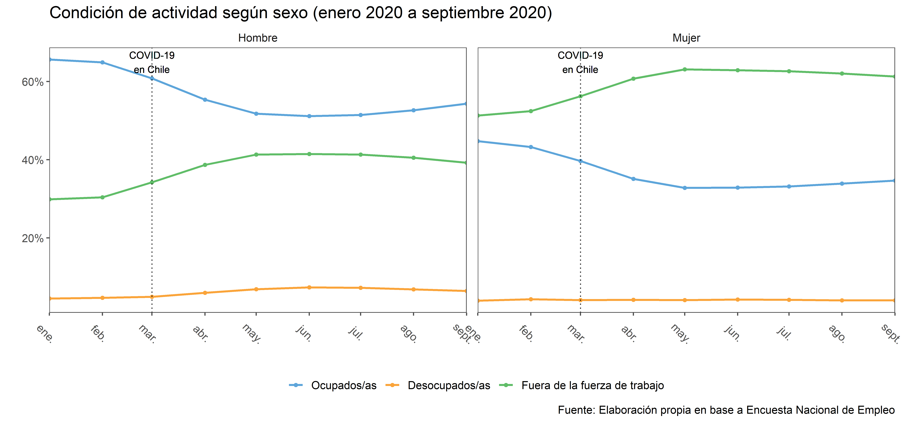
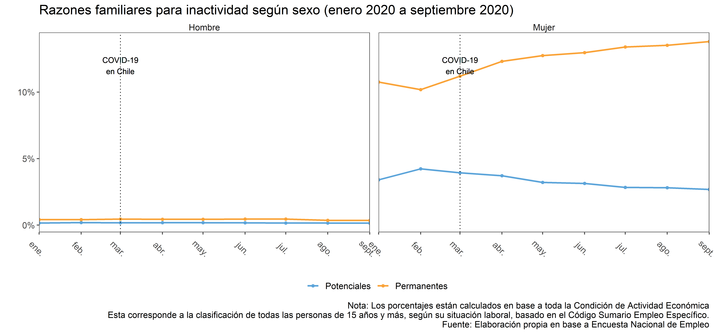
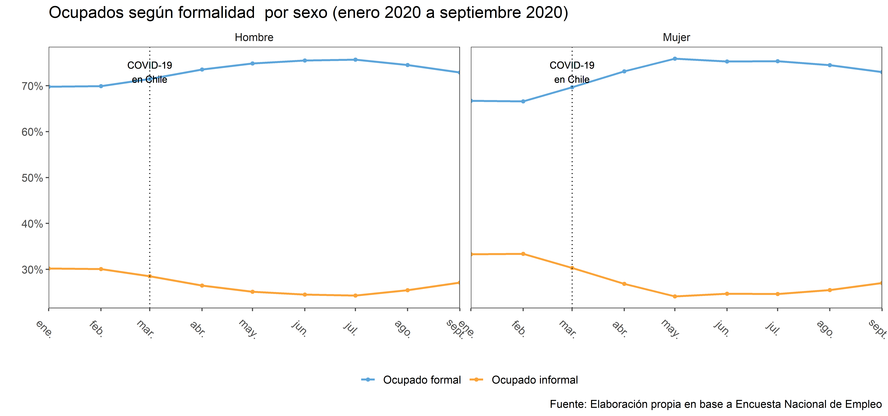
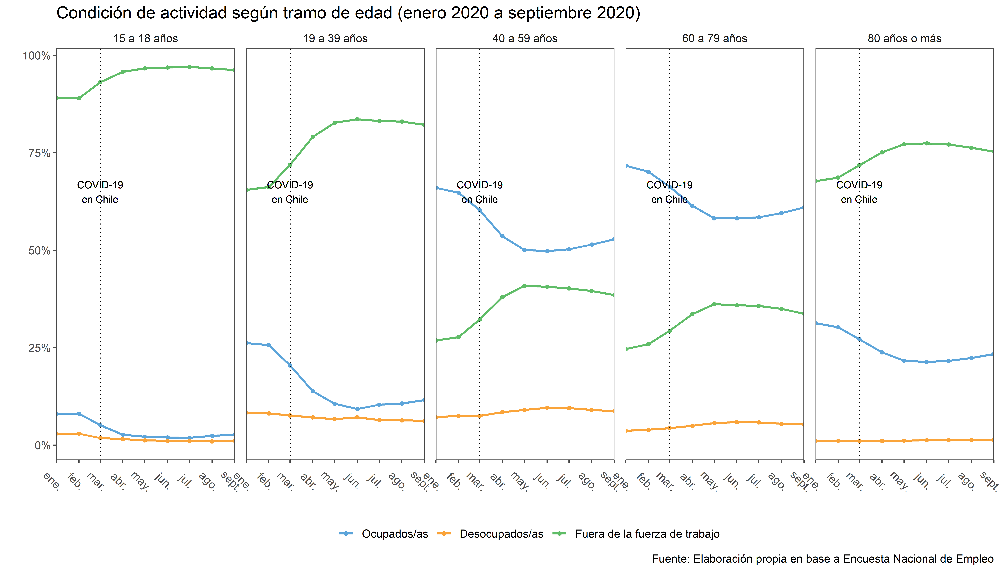
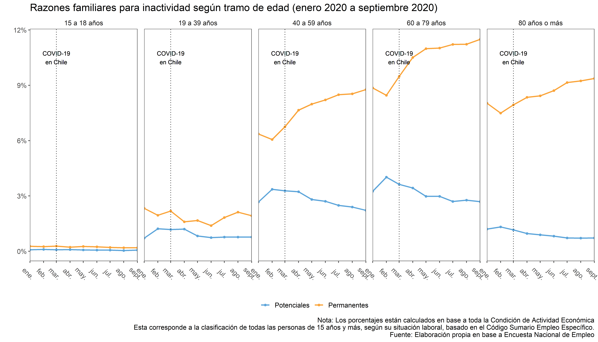
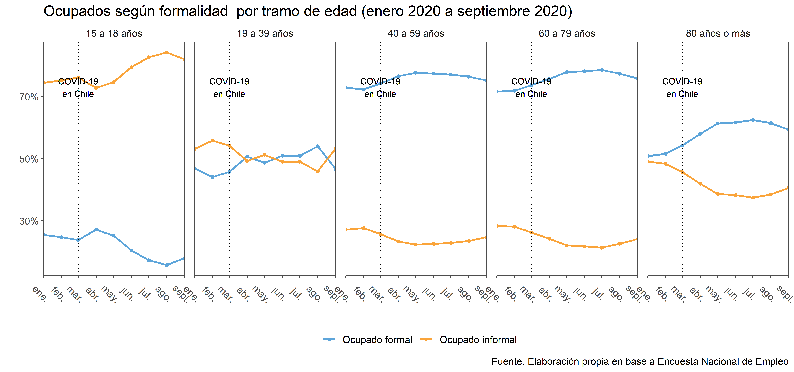
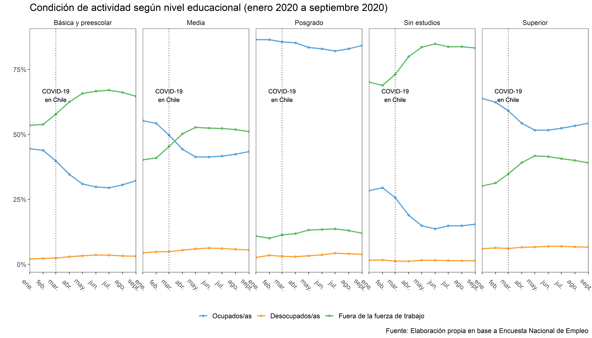
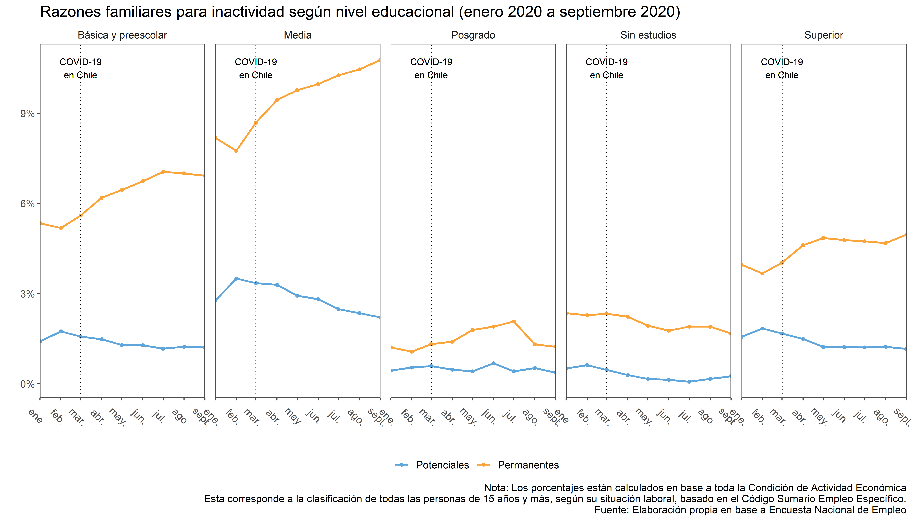
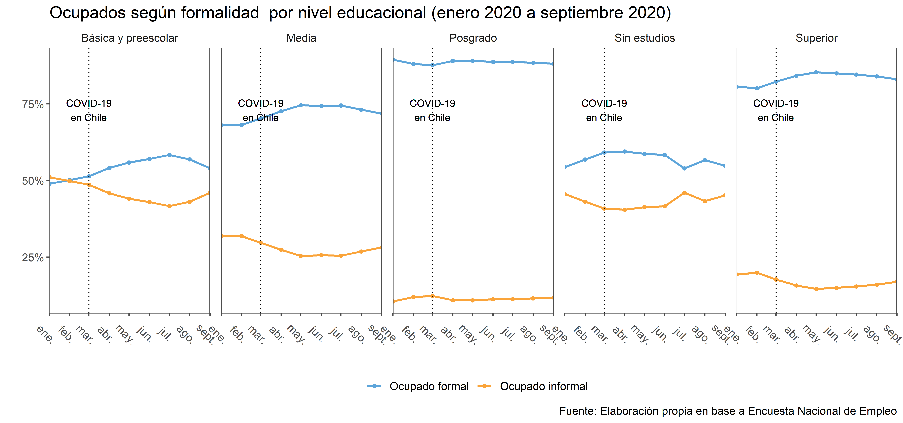

```{r, echo=FALSE, eval = FALSE}
htmltools::img(src = knitr::image_uri("../input/css/icon-192.png"), 
               alt = 'logo', 
               style = 'position:absolute; top:0; right:0; padding:10px;')
```

---

```{r setup, include=FALSE}
knitr::opts_chunk$set(echo = TRUE, message = F, warning = F, results = 'asis')
summarytools::st_options(bootstrap.css     = FALSE,       # Already part of the theme so no need for it
           plain.ascii       = FALSE,       # One of the essential settings
           style             = "rmarkdown", # Idem.
           dfSummary.silent  = TRUE,        # Suppresses messages about temporary files
           footnote          = NA,          # Keeping the results minimalistic
           subtitle.emphasis = FALSE)       # For the vignette theme, this gives better results.
#summarytools::st_css()

library(ggplot2); theme_set(theme_classic() + theme(text = element_text(size = 12)))
library(knitr);  options(knitr.kable.NA = '')
```


El presente reporte inicial está desarrollado con la Encuesta Nacional de Empleo, del Instituto Nacional de Estadística. Este instrumento es un diseño panel mensual que durante la pandemia por COVID-19 se ha desarrollado manteniendo su marco muestral representativo y probabilístico, pero realizando las entrevistas vía telefónica para no reducir sus tasas de respuesta. 

A continuación se trabajaron las series temporales desde enero a septiembre (última encuesta disponible). Para iniciar el análisis se muestra un análisis global de la situación de actividad económica, razones familiares para la inactividad (estar fuera de la fuerza de trabajo) y la situación de informalidad. Estos tres principales indicadores son desagregados por sexo, tramo etario y nivel educacional. 

Luego se incorporará un análisis de

1. Si los cambios se deben al COVID-19

2. Si para inactivas su renuncia se debe a razones de cuidados (temporales o permanentes)

3. Si para ocupadas ha significado una sobrecarga horaria o un subempleo de jornadas

4. Se agregarán variables de estratificación como parentesco, estado conyugal, si es el principal proveedor del hogar y región (o macrozona). 

5. Se agregarán hitos de políticas que defina el equipo. Al menos se tienen registradas el Ingreso Familiar de Emergencia, Entregas de Cajas Familiares, 1° retiro del 10%, instalación de residencias sanitarias.  A su vez se podrían agregar hitos comunitarios como: 1° noticia de ollas comunes, entre otras. 

# Por sexo

## Condición de actividad




## Razones familiares para inactividad



## Situación de formalidad para ocupados



# Por tramo etario

## Condición de actividad




## Razones familiares para inactividad



## Situación de formalidad para ocupados



# Por nivel educacional

## Condición de actividad




## Razones familiares para inactividad



## Situación de formalidad para ocupados


